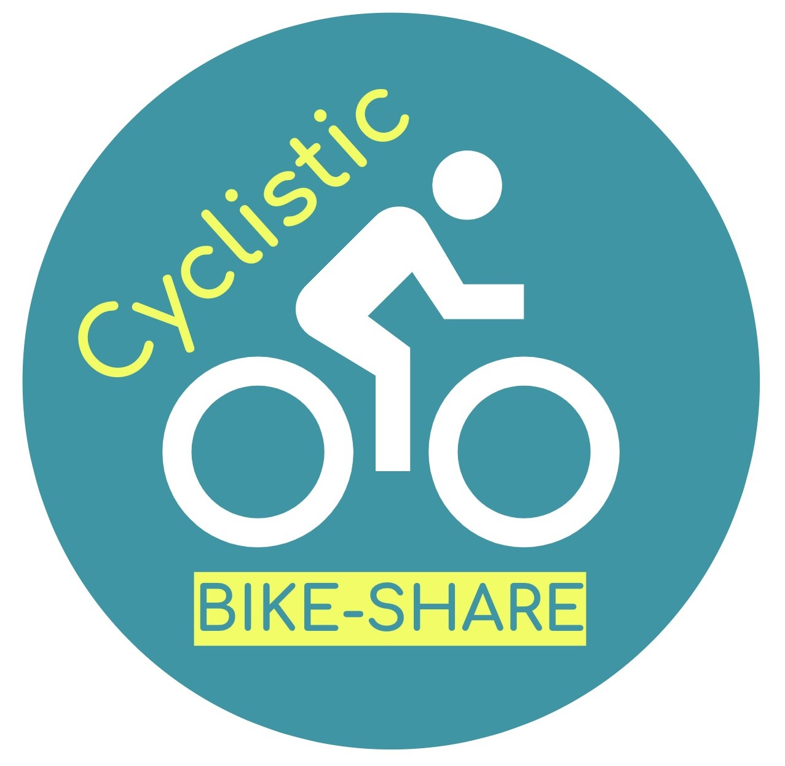

# Cyclistic Bike-share Analysis

_This repository is a part of my portfolio._  
Kindly contact me at ahmdrdo@gmail.com for queries.

## About This Repository

Cyclistic is **a fiction company** I used in this case. Cyclistic operates a bike-share program in Chicago with more than 600 docking stations. Cyclistic has flexibility in its pricing plans by offering single-ride passes, full-day passes, and annual memberships. Customers who purchase sing-ride or full-day passes are referred to as **casual riders**. Customers who purchase annual memberships are **Cyclistic members**.

Lily Moreno, the director of marketing and my manager for this case, set a plan to **design marketing strategies aimed at converting casual riders into members**. In order to do that, the marketing analyst team needs to better understand how annual members and casual riders differ, why casual riders would buy a membership, and how digital media could affect their marketing tactics. Moreno and her team are interested in analyzing the Cyclistic historical bike trip data to identify trends.

## Notes on Analysis

My work in this analysis focused to **identify how annual members and casual riders differ**. Insights from this analysis will be used to help the marketing in building their marketing strategies.

Dataset used in this analysis is available [here](https://divvy-tripdata.s3.amazonaws.com/index.html) along with the [license](https://ride.divvybikes.com/data-license-agreement).

**Resources**:  
* Published GitHub page [https://ahmdrdo.github.io/cyclistic_bikeshare/](https://ahmdrdo.github.io/cyclistic_bikeshare/)
* [Presentation](resources/cyclistic_presentation_pdf.pdf) (pdf format)
* [Report](resources/report_cyclistic_bikeshare.pdf) (pdf format)
* [R script](https://gist.github.com/ahmdrdo/ab1e08faa0c62546e14d0bcb22413702) used for analysis
